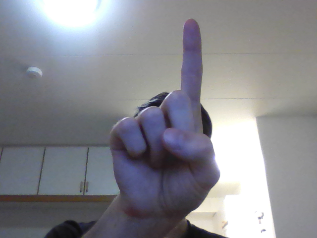
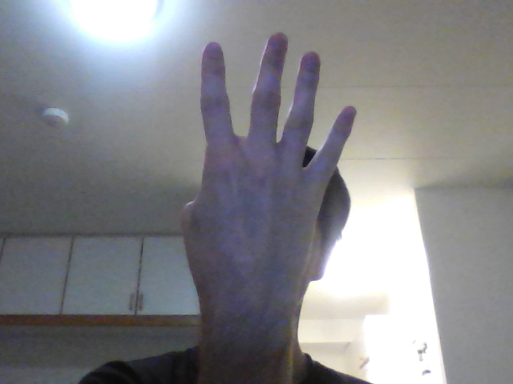
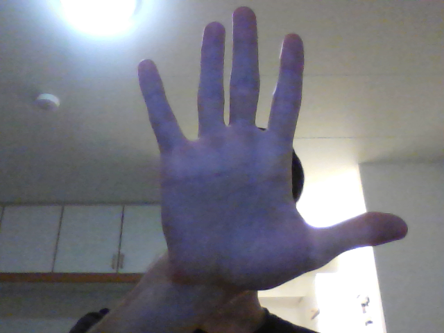
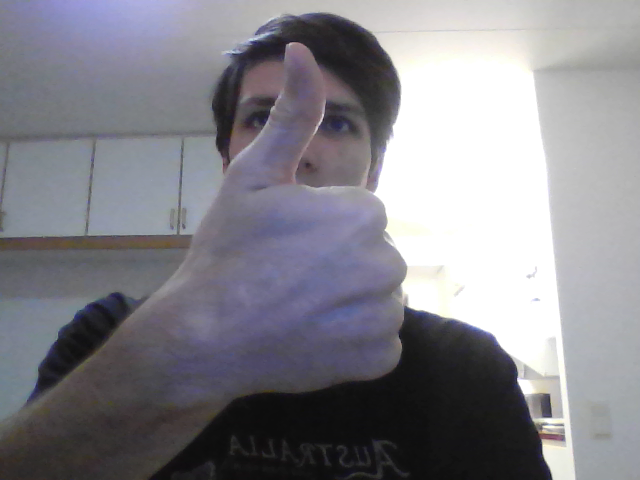

# HUMROgroup5
Repository for group 5's project in the Humanoid robotics course at Chalmers

Here we generate the data needed to train the classifier network.

Right now, we have the following classes

Class name              | Image of class
------------------------|---------------
0_front                 | 
0_back                  | 
1_front                 | 
1_back                  | 
2_thumb_front           | 
2_thumb_back            | 
2_front                 | 
2_back                  | 
3_thumb_front           | 
3_thumb_back            | 
3_front                 | 
3_back                  | 
4_front                 | 
4_back                  | 
5_front                 | 
5_back                  | 
+\_right_up_right_front | 
+\_right_up_left_front  | 
minus                   | 
ok_3_fingers            | 
ok_thubm_up             | 
not_ok_thumb_down       | 
equals                  | 
fck_u                   | 

##Usage
Make sure to first create the "dataset" directory.

Then start the 
```python 
generateDatasetFromLiveVideo_v2.py 
``` 
script and follow the instruction on the screen.
They will be explained here as well.
First you need to enter your name.
This is done so that we don't accidentally overwrite existing data.
Next, you need to adjust the size and shape of the rectangle
so that it fits your current hand gesture.
This is done with the following key combinations.

keypress      | action
------------- | -------------
h             | move right side to left
j             | move bottom side down
k             | move bottom side up
l             | move right side to right 
y             | finish adjusting

The 

### Configuration variables
#### Capture device 
```python 
camera = cv2.VideoCapture(0) # use computer camera
camera = cv2.VideoCapture("http://192.168.43.1:8080/video") # use camera on LAN
``` 

If you opt for the camera on LAN, install IP Webcam on your Android phone,
or anything which provides equivalent functionality on your phone.
Also, change the URL to match your IP address and comment the unused device.

#### Rectangle speed
```python 
offset = 2
``` 
This variable is the offset by which the rectangle moves in pixels.
It is most certainly too slow on HD, but it is nice on a small 640x480 resolution.
Furthemore, this variables changes the step size when adjusting the rectangle size.
