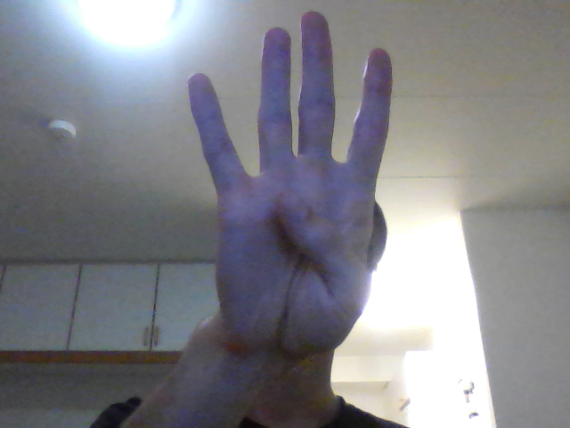

# HUMROgroup5
Repository for group 5's project in the Humanoid robotics course at Chalmers
The report will be made available at a later time. The system can be ran without a robotic if you want to test the vision capabilities. To start, clone the repository, download the weigths: the smaller network is available at https://drive.google.com/file/d/1_jNsGdboyXH6-c4XHjnWxAOINuGfAFCF/view?usp=sharing , and the larger at https://drive.google.com/file/d/1QjUIQbMeLW-58GiZtP7KQ2B0i0YGzZYN/view?usp=sharing . To use them, fix the paths in the code. Also, change the camera device in the inference process if desired. Finally, run Python init_system.py on a system with a Python with OpenCV and TkInter installed. We used Python 3.9.7, OpenCV 4.5.3 and TkInter 8.6. Possible you will also need to install PIL manually. We also use one NumPy function (argmax) so either install NumPy as well or change that function to an equivalent one.

The rest of this text explains how to generate data and all other information is available in the report.

Here we generate the data needed to train the classifier network.

Right now, we have the following classes:

Class name              | Image of class
------------------------|---------------
0_front                 | 
0_back                  | 
1_front                 | 
1_back                  | 
2_thumb_front           | 
2_thumb_back            | 
2_front                 | 
2_back                  | 
3_thumb_front           | 
3_thumb_back            | 
3_front                 | 
3_back                  | 
4_front                 | 
4_back                  | 
5_front                 | 
5_back                  | 
+\_right_up_right_front | 
+\_right_up_left_front  | 
minus                   | 
ok_3_fingers            | 
ok_thubm_up             | 
not_ok_thumb_down       | 
equals                  | 

##Usage
Make sure to first create the "dataset" directory.

Then start the 
```python 
generateDatasetFromLiveVideo_v2.py 
``` 
script and follow the instruction on the screen.
They will be explained here as well.
First you need to enter your name.
This is done so that we don't accidentally overwrite existing data.
Next, you need to adjust the size and shape of the rectangle
so that it fits your current hand gesture.
This is done with the following key combinations.

keypress      | action
------------- | -------------
h             | move right side to left
j             | move bottom side down
k             | move bottom side up
l             | move right side to right 
y             | finish adjusting

The rectangle will then start going around the screen in a counter-clockwise
manner and will follow the edges.

###IMPORTANT:
When you are done, please use open Filezilla and send me the generated data
(the entire content of the dataset directory). Once everything has
been (successfully) sent, you may delete the contents of your dataset directory.
I have ~1TB of storage on my server so I hope we should be fine.

Use the following to connect:
- host : 46.239.113.170 (may change, if something doesn't work please contact me)
- user : humro
- password : greendragoneatsapples
- port : 35174

Filezilla will say that it does not trust my certificate (nor should it by default).
This is so because i generated the certificate myself and did not validate it
(for money) with a 3rd party. Please accept the certificate and proceed.

## Please do the following when generating data
0. try to perform the challenge correctly :)
1. vary the distance between your lovely self and the camera
2. put your hand in various positions with respect to the rest of you body
3. perform all of the above in different lighting conditions
4. perform all of the above with different backgrounds
5. (optional) ask your friends to do the same

### Configuration variables
#### Capture device 
```python 
camera = cv2.VideoCapture(0) # use computer camera
camera = cv2.VideoCapture("http://192.168.43.1:8080/video") # use camera on LAN
``` 

If you opt for the camera on LAN, install IP Webcam on your Android phone,
or anything which provides equivalent functionality on your phone.
Also, change the URL to match your IP address and comment the unused device.

#### Rectangle speed
```python 
offset = 2
``` 
This variable is the offset by which the rectangle moves in pixels.
It is most certainly too slow on HD, but it is nice on a small 640x480 resolution.
Furthemore, this variables changes the step size when adjusting the rectangle size.

